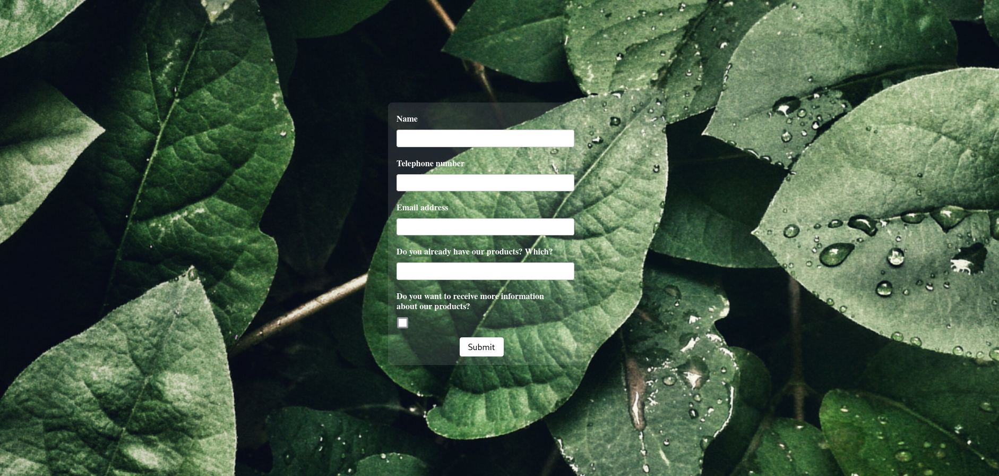

# Rust Landing Page

## Its available at https://landing-page-rs.onrender.com/
It will take a little while because the server turns off when pass some time without activity, but WAIT, and send me a message :) 

## About

It's just a simple landing page written entirely in rust.

Its used Rust Yew for frontend and Rust Rocket for Backend.

It will send the input data to the email set.

## Repository Struct

### Backend
  - You can set your configurations at environment variables.
     * email_receiver: who will receive all the leads
     * smtp_email: email adress that sends the emails
     * smtp_host: the email smtp service host
     * smtp_key: the key to autenticate on the smtp

### Frontend
  - You can also set a different background at frontend/static.

## Screenshot

